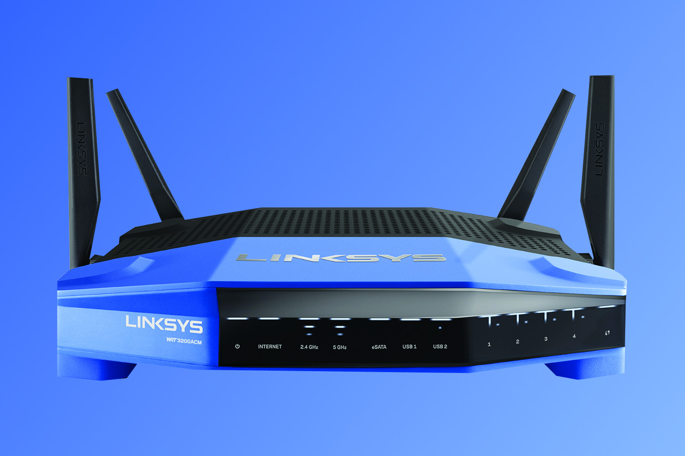

# GitHub Action Script Custom Modded By Eliminater74
## Original from [P3TERX](https://github.com/P3TERX/Actions-OpenWrt)
### Created to make building OpenWRT easier using github actions.

## Notes:
- Patches directory are taken from: [Divested-WRT: UNOFFICIAL OpenWrt builds](https://divested.dev/unofficial-openwrt-builds/mvebu-linksys/patches/)
- mwlwifi is taken from: [Lean's Openwrt source code repository](https://github.com/coolsnowwolf/lede/tree/master/package/kernel/mwlwifi)
- modifications to action script By Eliminater74
_______________________________________________________________________

### Latest Release Downloads:

### Total Downloads:

# Actions-OpenWrt

### Repo Updated:

_______________________________________________________________________
## INSTRUCTIONS FOR USE:

Use Template or fork Github,

once you have it, then git clone it to your linux box. Yes I think its possible to use the windows ubuntu. But dont quote me on that..

anyhow, after you do that

clone openwrt github to your linux box as well..

then inside the Action github, copy this:

From: CONFIGS Dir:

- patches <----- Directory Copy whole Dir

- feeds.conf.default

- wrt3200acm.config <---- in my case,

NOTE: I could personally copy the above wrt3200acm.config no matter what device your running on,
and make changes from that config, since its always updated to latest test.. you can just change the device from within the menuconfig for your device.

From SCRIPTS Dir:

- manual-generate.sh

- diy-part1.sh

- diy-part2.sh

- lean_packages.sh

- sirpdboy-package.sh

- DevOpenWRT-Router.sh

Copy all the above files and or Dir's to root of cloned openwrt,

then type
- ./manual-generate.sh

and sit back and wait till you see the menuconfig startup screen..
then make your changes and save as your device name that you see in configs dir.
once you understand what ypur doing, you can edit: manual-generate.sh
to rename your device .config file and not the wrt3200acm.config .

For now use the wrt3200acm.config and make your changes from there.
once you have your device config,\copy it over to the Action github under CONFIGS,
push back to git;

then run your Action workflow.
and wait.. about 4 - 5 hours.. possibly less.

_______________________________________________________________________

Build OpenWrt using GitHub Actions

[Instructions (Use Translater)](https://p3terx.com/archives/build-openwrt-with-github-actions.html)

## Usage

- Click the [Use this template](https://github.com/P3TERX/Actions-OpenWrt/generate) button to create a new repository.
- Generate `.config` files using [Lean's OpenWrt](https://github.com/coolsnowwolf/lede) source code. ( You can change it through environment variables in the workflow file. )
- Push `.config` file to the GitHub repository.
- Select `Build OpenWrt` on the Actions page.
- Click the `Run workflow` button.
- When the build is complete, click the `Artifacts` button in the upper right corner of the Actions page to download the binaries.

## Tips

- It may take a long time to create a `.config` file and build the OpenWrt firmware. Thus, before create repository to build your own firmware, you may check out if others have already built it which meet your needs by simply [search `Actions-Openwrt` in GitHub](https://github.com/search?q=Actions-openwrt).
- Add some meta info of your built firmware (such as firmware architecture and installed packages) to your repository introduction, this will save others' time.

## Usage

- Click the [Use this template](https://github.com/P3TERX/ActionsVM/generate) button to create a new repository.
- Select `macOS (tmate)` or `Ubuntu (tmate)` on the Actions page.
- Click the `Run workflow` button.
- Get the connection info in the log.

## TIPS

- Note that your repo needs to be public, otherwise you have a strict monthly limit on how many minutes you can use.
- Your session can run for up to six hours. Don't forget to close it after finishing your work, otherwise you will continue to occupy this virtual machine, making it impossible for others to use it normally.
- Please check the [GitHub Actions Terms of Service](https://docs.github.com/en/github/site-policy/github-additional-product-terms#5-actions-and-packages). According to the TOS the repo that contains these files needs to be the same one where you're developing the project that you're using it for, and specifically that you are using it for the "_production, testing, deployment, or publication of [that] software project_".

## Advanced

### SSH by using [ngrok](https://ngrok.com/)

Click the `Settings` tab on your own repository, and then click the `Secrets` button to add the following encrypted environment variables:

- `NGROK_TOKEN`: Sign up on the <https://ngrok.com> , find this token [here](https://dashboard.ngrok.com/auth/your-authtoken).
- `SSH_PASSWORD`: This password you will use when authorizing via SSH.

### Send connection info to [Telegram](https://telegram.org/)

Click the `Settings` tab on your own repository, and then click the `Secrets` button to add the following encrypted environment variables:

- `TELEGRAM_BOT_TOKEN`: Get your bot token by talking to [@BotFather](https://t.me/botfather).
- `TELEGRAM_CHAT_ID`: Get your chat ID by talking to [@GetMyID_bot](https://t.me/getmyid_bot) or other similar bots.

You can find Telegram Bot related documents [here](https://core.telegram.org/bots).`

## Acknowledgments

- [P3TERX](https://github.com/P3TERX/Actions-OpenWrt)
- [Microsoft Azure](https://azure.microsoft.com)
- [GitHub Actions](https://github.com/features/actions)
- [OpenWrt](https://github.com/openwrt/openwrt)
- [Lean's OpenWrt](https://github.com/coolsnowwolf/lede)
- [tmate](https://github.com/tmate-io/tmate)
- [mxschmitt/action-tmate](https://github.com/mxschmitt/action-tmate)
- [csexton/debugger-action](https://github.com/csexton/debugger-action)
- [Cowtransfer](https://cowtransfer.com)
- [WeTransfer](https://wetransfer.com/)
- [Mikubill/transfer](https://github.com/Mikubill/transfer)
- [softprops/action-gh-release](https://github.com/softprops/action-gh-release)
- [c-hive/gha-remove-artifacts](https://github.com/c-hive/gha-remove-artifacts)
- [dev-drprasad/delete-older-releases](https://github.com/dev-drprasad/delete-older-releases)

  
